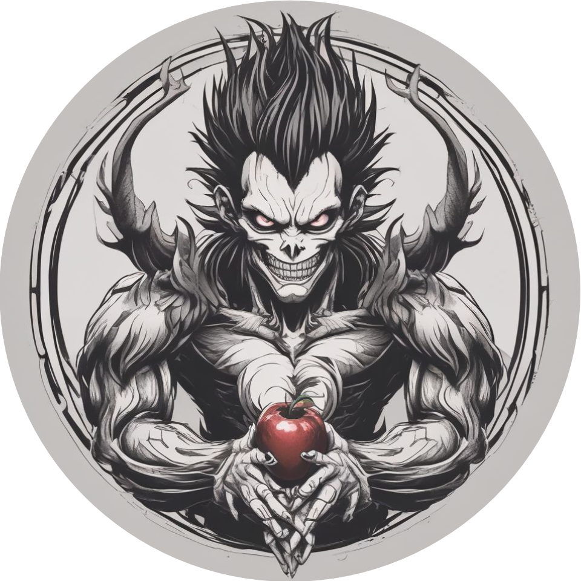
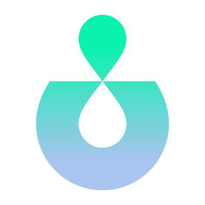

## Hi there Friend😁

## 🙋🏽About Me:
I am a skilled software engineer with a background in full-stack development. Focusing on Golang, React, and the Cairo programming language. I am very familiar with building secure REST APIs, and Backends solutions, creating responsive front-end web applications.

On personal projects like PassIn, where I added encryption to protect user data, and Panda Eats, where I improved the online food ordering experience. I am confident in my ability to solve problems and deliver results as seen in the projects I have worked on.

Beyond my professional work, I contribute to open-source projects. Where I contributed to key features and tests for the Shinigami Bitcoin Script VM and Carbonable's protocol. 

I combine technical skills with a strong desire for learning and problem-solving. This allows me to break down complex challenges into small bits and deliver solutions that make a difference. I'm always eager to take on new projects and continue growing in this ever-evolving field.

- 🔮 Open source contributor: [onlyDust](https://app.onlydust.com/u/Shoetan).
- 📫 How to reach me: [soetan.dev@gmail.com](https://soetan.dev@gmail.com).

## 💻 Tech Stack:
             

## 📖 Blog Posts
| S/N      | Title                                   | Link     |
|----------|-----------------------------------------|----------|
| 1        | Buildig a CLI in Golang                 | Data 3   |
| 2        | Connect PostgreSQL to your Golang app   | Data 6   |
| 3        | Getting started with RabbitMQ           | Data 9   |
| 4        | Run PostgreSQL & pgAdmin in Docker      | Data 9   |

## 🛠 I've contributed to

## 🪴 Currently Learning

## 🌐 Socials
  

<!--
**Shoetan/Shoetan** is a ✨ _special_ ✨ repository because its `README.md` (this file) appears on your GitHub profile.

Here are some ideas to get you started:
- 😄 Pronouns: ...

-->
